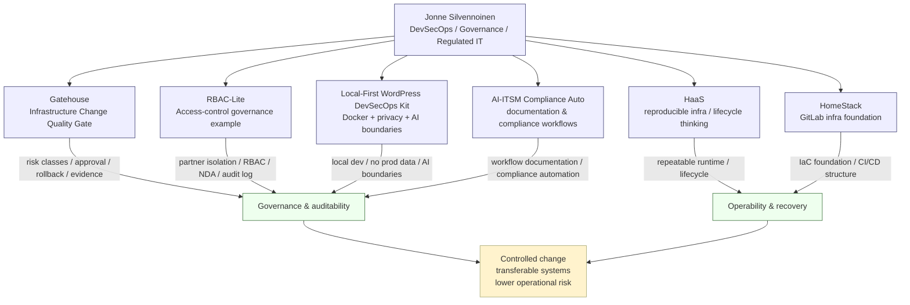

# Jonne Silvennoinen 👋🏻

**DevSecOps Engineer | Governance & Compliance Automation | Regulated Environments | ISO 27001 · MDR · NIS2**


## About

I design and validate secure infrastructure, governance-aware workflows and compliance-driven technical solutions.

My work focuses on reliable, auditable delivery where configuration, testing, documentation and validation prevent issues from reaching end users. I operate across public-sector, healthcare-adjacent, regulated and infrastructure-heavy environments with attention to operational reliability, governance and controlled change.

My work aligns strongly with DevSecOps principles: security and compliance built into CI/CD pipelines, automated validation gates, local-first development safety and audit-ready delivery rather than post-hoc controls.

I’m strongest in designing and building portable, validated, documentation-driven solutions end-to-end. I may not yet own large-scale production platforms end-to-end, but I build systems and governance structures that are ready to be reviewed, transferred, operated and improved by others.


## How I think

As a developer, I care about repeatability, validation and evidence.

As an operator, I care about recoverability, ownership and clear boundaries.

As an architect, I care about knowing what not to build yet.

**Code is debt.**

Not because code is bad, but because every line creates future responsibility: maintenance, security, documentation, testing, ownership and operational risk.

Documentation is an asset when it makes the system understandable, transferable and recoverable.

Tests and audit evidence are what keep technical debt from becoming organizational risk.

I do not try to build perfect final-state systems for imagined final-state worlds.

I prefer lightweight, auditable and recoverable structures where the right solution can evolve safely without the project collapsing under its own complexity.

**Complexity is not maturity.**
**Maturity is knowing what not to build yet.**

## Portfolio architecture



## Current

* **Location:** Finland
* **Available:** Selective opportunities in Cloud Infrastructure, DevSecOps, Compliance Automation, Technical Consulting and regulated IT environments
* **Background:** Co-founder & Regulatory Lead experience in a MedTech startup context — ISO 13485 / MDR environment
* **Direction:** Secure infrastructure delivery, compliance-driven environments, IAM/RBAC, CI/CD quality gates, local-first development safety and operational governance
* **Core theme:** Building compliance automation and operational clarity as a response to governance debt in hype-driven development culture

## Core skills

* Azure & cloud governance foundations
* Microsoft 365 / Entra ID foundations
* Active Directory / hybrid identity fundamentals
* Infrastructure as Code thinking
* Docker Compose based development environments
* CI/CD automation and pipeline validation
* GitHub Actions quality gates
* MDR / ISO 27001-aligned documentation exposure
* ITIL 4 and operational processes
* Technical documentation and validation plans
* Audit-ready artefacts and evidence chains
* Access-control governance / RBAC thinking
* AI-assisted development with clear operational boundaries
* Local-first AI workflows and development data safety

## Tech stack & tooling

<!-- Platform & OS -->


<!-- Cloud & identity -->


<!-- Containers & CI -->


<!-- IaC & scripting -->


<!-- Languages & tooling -->


I use these tools primarily for:

* building reproducible infrastructure
* validating changes through CI/CD
* producing audit-ready documentation and evidence
* making systems easier to review, recover and transfer between teams
* reducing local development drift and onboarding friction
* keeping AI-assisted development inside clear operational boundaries

Detailed areas:

* **Operating systems:** Linux, Windows
* **Cloud & identity:** Microsoft 365, Azure, Entra ID / Azure AD foundations, Active Directory fundamentals
* **Containers & runtime:** Docker, Docker Compose
* **CI/CD & automation:** GitHub Actions, validation workflows, quality gates
* **Infrastructure & configuration:** Infrastructure as Code thinking, YAML, repeatable runtime configuration
* **Scripting:** Bash, PowerShell, Python
* **Languages / tooling exposure:** Python, PHP / WordPress context, Rust tooling exposure, SQL, JavaScript / Node.js basics
* **ITSM & operations:** ITIL 4 practices, service processes, compliance workflows
* **AI & automation:** local-first AI workflows, RAG concepts, AI-agent boundaries, API-driven documentation automation
* **Documentation & validation:** technical documentation, validation plans, audit-ready artefacts, CLI-first repeatable scripts
* **Security & compliance exposure:** MDR, ISO 27001-aligned environments, GDPR-aware development practices, regulated delivery

## Project badges


[](https://github.com/Jonnenpijonne/infrastructure-change-quality-gate/actions/workflows/audit-evidence-report.yml)
[](https://github.com/Jonnenpijonne/infrastructure-change-quality-gate/actions/workflows/codeql-python.yml)

[](https://github.com/Jonnenpijonne/RBAC-Lite/actions/workflows/compliance-check.yml)

[](https://github.com/JonSil89/Home-Assistant-as-a-Service-HAaaS-/actions/workflows/blank.yml)
[](https://github.com/JonSil89/AI-ITSM-Compliance-Auto/actions/workflows/compliance-check.yml)
[](https://github.com/JonSil89/AI-ITSM-Compliance-Auto/actions/workflows/policy-guard.yml)

## Featured projects

### Gatehouse / Infrastructure Change Quality Gate

[](https://github.com/Jonnenpijonne/infrastructure-change-quality-gate)

**Role:** Architecture & implementation — compliance-aware automated change validation
**Tech:** Python, GitHub Actions, Markdown
**Focus:** Risk classification, approval requirements, rollback planning, audit evidence and CI/CD validation

Notes:

* Markdown-based change requests
* Risk classes 1–3
* Quality gate validation
* Audit evidence reporting
* CodeQL workflow
* RBAC-Lite integration example
* Demo-friendly validator flow for controlled change review

### RBAC-Lite

[](https://github.com/Jonnenpijonne/RBAC-Lite)

**Role:** Access-control governance and compliance example
**Tech:** WordPress / PHP, Markdown, GitHub Actions, Python validation tooling
**Focus:** Partner isolation, RBAC thinking, NDA/terms enforcement, audit logging and governance validation

Notes:

* Lightweight WordPress-based RBAC/access-control reference
* Partner-based data isolation model
* User-to-partner assignment thinking
* NDA / terms enforcement concept
* Gatehouse-compatible compliance example
* Main branch protected against force pushes and deletion
* Completion report documenting the RBAC-Lite + Gatehouse governance work

### Local-First WordPress DevSecOps Kit

[](https://github.com/Jonnenpijonne/local-first-wordpress-devsecops-kit)

**Role:** Local-first DevSecOps model and public-safe portfolio starter kit
**Tech:** Docker Compose, WordPress, MariaDB, Mailpit, Bash, Markdown, Mermaid
**Focus:** Safe local development, privacy-aware data handling, AI boundaries, developer onboarding and audit evidence templates

Notes:

* One-command WordPress development runtime
* Docker Compose stack with localhost-bound services
* No production data in development principle
* Development data flow with anonymization and secret scan model
* AI boundary model: assistive, not autonomous
* Evidence templates for local environment validation and anonymization logs
* Public-safe refactoring of a regulated project development model

### AI-Powered ITSM Documentation & Automated Compliance Workflows

[](https://github.com/JonSil89/AI-Powered-ITSM-Documentation-Building-automated-compliance-workflows-using-ClickUp-AI.)

**Role:** Solution design & automation for ITSM documentation and compliance workflows
**Tech:** ClickUp + AI workflows, documentation automation
**Focus:** Compliance documentation, workflow automation, ITSM-oriented evidence generation

Notes:

* AI-assisted documentation workflow
* Compliance-oriented process thinking
* ITSM documentation and operational structure
* Early foundation for AI-assisted governance workflows

### Home Assistant as a Service — HaaS

[](https://github.com/JonSil89/Home-Assistant-as-a-Service-HAaaS-)

**Role:** Solution design & reproducible infrastructure
**Tech:** YAML, GitHub Actions, Docker
**Focus:** Lifecycle management, reproducible infrastructure and automation

Notes:

* Device onboarding → maintenance → decommissioning
* Lifecycle management model
* RAG architecture roadmap for AI-driven documentation search
* Automated Azure deployment validation workflows
* Supporting evidence for infrastructure lifecycle and repeatability thinking

### Auto-Assign Passing — CI/CD validation & reporting

**Role:** Pipeline automation & reporting
**Tech:** GitHub Actions, shell scripting, HTML reporting
**Focus:** Pass/fail gating and human-readable workflow output

Notes:

* The Auto Assign badge above points to the demo repository workflow.
* Used as a lightweight CI/CD reporting proof.

### Proof — HTML passing / reporting

**Role:** Validation reporting
**Tech:** GitHub Actions, HTML reporting, scripts
**Focus:** Human-readable pass/fail HTML reports for release gates

Notes:

* The Proof HTML badge above points to the demo repository workflow.

## GitLab — HomeStack

[](https://gitlab.com/Jonnenpijonne/homestack)

**Project:** HomeStack
**Summary:** Infrastructure-as-Code foundation for modular home services
**Key artefacts:** CI/CD configuration, CHANGELOG, CONTRIBUTING guidelines, Apache 2.0 license

## Achievements

* Migrated hundreds of devices in critical healthcare HVA environments with minimal disruption
* Built audit-ready documentation and validation artefacts for MedTech systems in regulated environments
* Designed and built Gatehouse / Infrastructure Change Quality Gate — an ISO 27001-aligned CI/CD quality gate concept, demo-friendly with example change requests
* Built RBAC-Lite + Gatehouse governance documentation showing how access-control changes can be made auditable, reviewable and CI/CD-validatable
* Created a public-safe Local-First WordPress DevSecOps Kit to demonstrate Dockerized local development, privacy-safe data handling, AI boundaries and audit evidence templates
* Applied lightweight governance thinking: build only the structure needed now, while preserving auditability, recoverability and future evolution

## Credentials & learning evidence

[](https://learn.microsoft.com/users/jonnesilvennoinen-7257/credentials/ca01c7ed2e401f38)


* **Microsoft Applied Skills:** Administer Active Directory Domain Services
  Credential ID: `CA01C7ED2E401F38`
  Focus: AD DS administration, domain services, hybrid identity foundations and operational troubleshooting.
  ## Microsoft Applied Skills — Active Directory Domain Services


**Completed:** 5 May 2026
**Focus:** Active Directory Domain Services, Microsoft hybrid identity foundations, Group Policy, domain services and operational troubleshooting

This Microsoft Applied Skills credential is a practical, lab-based skills demonstration focused on administering Active Directory Domain Services.

I do not position this as an Expert-level Microsoft certification or as a replacement for years of production ownership of large enterprise AD environments. Its value is different: it validates hands-on capability in one of the most operationally important layers of Microsoft hybrid infrastructure.

The assessment aligns directly with practical AD DS administration work, including domain controller management, AD topology, AD DS objects, Group Policy Objects and AD DS security.

### Key areas demonstrated

* Deploying and managing AD DS domain controllers
* Understanding and working with FSMO roles
* Managing domain and forest-level AD DS responsibilities
* Configuring Active Directory topology, sites and subnets
* Managing AD DS users, groups and organizational units
* Handling disabled users, password resets and account-related operational tasks
* Managing privileged groups and protected user concepts
* Creating and linking Group Policy Objects
* Configuring GPO scope, inheritance and processing order
* Troubleshooting applied Group Policy with tools such as `gpresult` and `gpupdate`
* Understanding DNS dependencies in AD DS environments
* Troubleshooting domain controller health and DNS-related AD issues
* Understanding AD replication and operational diagnostics
* Using tools such as `repadmin`, `dcdiag`, `nltest`, `nslookup`, `eventvwr` and PowerShell
* Testing and resetting secure channel issues
* Configuring domain password policy and Fine-Grained Password Policies
* Understanding that Fine-Grained Password Policies are targeted to users or groups, not organizational units
* Delegating permissions in AD DS
* Configuring auditing and security-related settings through Group Policy
* Understanding event logs relevant to AD DS operations, including Directory Service, DNS Server and System logs

### Operational troubleshooting mindset

My AD DS study and lab work focused especially on practical troubleshooting rather than only directory object management.

A typical troubleshooting flow I use:

```text
1. gpresult / gpupdate  → Is Group Policy applying correctly?
2. nslookup             → Does DNS resolve correctly?
3. nltest               → Is the secure channel healthy?
4. repadmin             → Is AD replication healthy?
5. FSMO role check      → Which domain controller owns the critical role?
6. Event logs           → What does the system actually report?
```

Common AD DS root causes I pay attention to:

```text
1. Incorrect DNS configuration
2. Broken or delayed replication
3. Broken secure channel
4. Incorrect GPO or FGPP targeting
5. Wrong domain controller or PDC Emulator dependency
6. Missing or stale group membership
7. Authentication or policy dependencies affecting end users
```

### How this connects to my wider portfolio

In my portfolio, this credential acts as the Microsoft identity infrastructure foundation behind my broader DevSecOps, governance and operational security work.

My projects focus on controlled change, access control, auditability, recoverability and safe development workflows. AD DS connects directly to these themes because identity infrastructure is where governance becomes operational reality.

* **Gatehouse / Infrastructure Change Quality Gate** demonstrates risk-based change validation, approval requirements, rollback planning and audit evidence.
* **RBAC-Lite** demonstrates access-control governance, partner isolation, role-based access concepts and audit logging.
* **Local-First WordPress DevSecOps Kit** demonstrates safe local development, Docker-based reproducibility, no-production-data principles, AI boundaries and recoverability.
* **AD DS Applied Skills** anchors these themes in Microsoft hybrid infrastructure: users, groups, Group Policy, DNS dependencies, replication, secure channel, privileged access, auditing and operational troubleshooting.

This combination reflects my current technical direction:

```text
DevSecOps thinking
+ Microsoft hybrid infrastructure
+ identity and access governance
+ operational troubleshooting
+ regulated environment awareness
+ audit-ready documentation
```

### Why this matters

Active Directory is not simply a legacy technology. It remains a mature core infrastructure layer in many enterprise, public-sector, healthcare-adjacent and critical environments.

Modern Microsoft environments often depend on a hybrid reality where Microsoft 365, Entra ID, Intune and cloud services are connected to older but still critical AD DS, DNS, GPO and Windows Server foundations.

This credential supports my ability to understand that bridge:

```text
on-prem AD DS
→ hybrid identity
→ Entra ID / Microsoft 365
→ endpoint and access management
→ operational security
→ governed and auditable change
```

The value of this credential is not that it makes me a senior AD architect by itself. The value is that it gives practical, Microsoft-validated evidence that I understand the operational foundation behind identity, policy, access and troubleshooting in Microsoft-based environments.

Combined with my HVA migration experience, Microsoft 365 / Entra ID / Intune exposure, ITSM background, documentation work and governance-focused GitHub projects, it strengthens my profile toward Microsoft hybrid infrastructure, AD/Windows operations, identity governance and DevSecOps-oriented operational maturity.


* **HealthTech regulatory training:** Regulatory Essentials in Health Tech / PRRC
  Focus: MDR/IVDR responsibilities, risk management, audit readiness, post-market surveillance and authority communication.

* **Microsoft Learn transcript:** broad learning record across Microsoft 365, Azure, Entra ID, Purview, Defender, DevOps, governance and security fundamentals.

## Languages


