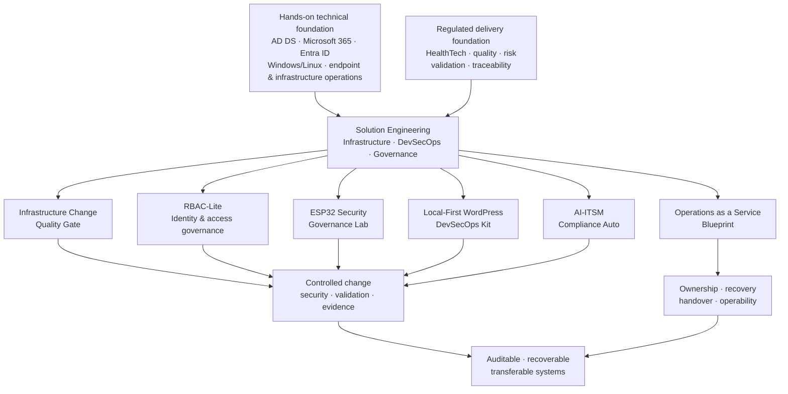

# Jonne Silvennoinen

**Solution Engineering | Infrastructure, DevSecOps & Governance**

I design and validate controlled, auditable infrastructure and automation where security, testing, documentation, rollback and operational ownership are part of delivery — not an afterthought.

My strongest work sits at the intersection of infrastructure, CI/CD, IAM/RBAC, operational security, governance and compliance-aware automation. I prefer lightweight systems that can be reviewed, recovered, transferred and improved by other people instead of fragile one-person solutions.

> **Complexity is not maturity. Maturity is knowing what not to build yet.**

## Portfolio architecture

The projects below are different implementations of the same operating idea: hands-on infrastructure and regulated-delivery experience translated into controlled, auditable and transferable systems.

## Featured work

### [Infrastructure Change Quality Gate](https://github.com/Jonnenpijonne/infrastructure-change-quality-gate)
A lightweight DevSecOps policy and validation engine for infrastructure changes: risk classes, automated checks, approval gates, rollback requirements, test plans and audit evidence.

### [ESP32 IoT Security Governance Lab](https://github.com/Jonnenpijonne/esp32-iot-security-governance-lab)
Edge-device assurance lab covering threat modelling, secure configuration, OTA/update risk, rollback, firmware validation and audit evidence.

### [Local-First WordPress DevSecOps Kit](https://github.com/Jonnenpijonne/local-first-wordpress-devsecops-kit)
A reproducible local development baseline for regulated or privacy-sensitive WordPress work using Docker Compose, explicit AI/data boundaries, CI/CD checks, runbooks and secret-scanning controls.

### [RBAC-Lite](https://github.com/Jonnenpijonne/RBAC-Lite)
A lightweight IAM/RBAC and partner-isolation example focused on tenant boundaries, access governance, auditability and Gatehouse-governed change control.

### [Operations as a Service Blueprint](https://github.com/Jonnenpijonne/operations-as-a-service-blueprint)
A public-safe operations model for service ownership, escalation, controlled change, recovery, handover and audit evidence.

### [AI-ITSM Compliance Auto](https://github.com/JonSil89/AI-ITSM-Compliance-Auto)
Workflow and compliance-automation experiments around ITSM, validation and AI-assisted operational documentation.

`JonSil89` is a GitHub organization I use for selected shared/demo projects; `Jonnenpijonne` is my personal account.

## Verified credentials

### [Microsoft Applied Skills: Administer Active Directory Domain Services](https://learn.microsoft.com/users/jonnesilvennoinen-7257/credentials/ca01c7ed2e401f38)
**Microsoft · completed 5 May 2026 · Credential ID `CA01C7ED2E401F38`**

A performance-based Microsoft Applied Skills credential earned through a two-hour interactive assessment lab. The assessment evaluates hands-on administration of AD DS domain controllers and topology, directory objects and privileged groups, Group Policy, delegated access, password and security policy, and auditing. Microsoft's published assessment scope includes tasks such as deploying domain controllers, transferring FSMO roles, configuring sites and subnets, managing gMSA and Protected Users, recovering directory objects, and configuring GPOs.

Detailed portfolio notes: [`docs/credentials/MICROSOFT_ADDS_APPLIED_SKILLS.md`](docs/credentials/MICROSOFT_ADDS_APPLIED_SKILLS.md)

### Regulatory Essentials in Health Tech / PRRC
**Labquality / Aurevia · completed December 2024**

Regulatory training and certificate covering medical-device and IVD regulatory responsibilities, risk management, post-market surveillance, quality-management responsibilities and the PRRC role.

## Professional foundation

- **Critical healthcare and public-sector ICT:** practical work across Microsoft 365, Entra ID / Azure AD, on-prem Active Directory, Intune, SCCM-related support, Efecte ITSM, application-access dependencies, workstation/user-environment migrations and operational troubleshooting.
- **Regulated HealthTech:** quality, risk, validation and compliance documentation in ISO 13485, ISO 14971 and MDR contexts, including co-founder and regulatory-quality responsibilities.

## Core technology stack

Primary tools and platforms that recur across my operational work and authored portfolio:

## Engineering principles

- **Controlled change:** changes should have scope, ownership, validation and rollback.
- **Evidence over claims:** tests, CI results and audit artefacts are stronger than architecture language alone.
- **Recoverability:** a system should be rebuildable and transferable, not dependent on one person's memory.
- **Least privilege and clear boundaries:** access and automation should be constrained intentionally.
- **Local-first where appropriate:** keep development data and AI-assisted workflows inside explicit safety boundaries.
- **Documentation as an operational asset:** documentation should help someone operate, restore or review the system.
- **Code is debt:** every line creates future maintenance, security, testing and ownership obligations.

## Core areas

**Infrastructure & platforms**  
Linux · Windows · Microsoft 365 · Entra ID · Active Directory foundations · Azure foundations · Docker · Docker Compose · Infrastructure-as-Code thinking

**Automation & CI/CD**  
GitHub Actions · Bash · PowerShell · Python · YAML · validation gates · policy checks · repeatable CLI workflows

**Security & governance**  
IAM/RBAC · operational security · audit evidence · controlled change · threat modelling · GDPR-aware development practices · ISO 27001-aligned control thinking · MDR / regulated-environment exposure

**Documentation & operations**  
Runbooks · validation plans · architecture notes · change records · recovery thinking · ITIL 4 practices · ITSM workflows

**AI-assisted engineering**  
Local-first AI workflows · RAG concepts · agent boundaries · API-driven automation · human review and explicit source-of-truth separation

## How I think

As an engineer, I care about repeatability, validation and evidence.

As an operator, I care about recoverability, ownership and clear boundaries.

When designing systems, I care about making the smallest system that is sufficient now without blocking the next safe step.

I do not treat a large technology list as proof of engineering maturity. The portfolio projects above are intended to show the design decisions, constraints, validation and operational reasoning behind the implementation.

## Portfolio note

This account also contains forks, training repositories, upstream references and experiments used for learning or evaluation. Those repositories are not presented as original portfolio work unless the repository documentation explicitly says otherwise. The projects listed under **Featured work** are the primary authored portfolio artefacts I want reviewers to evaluate.

## Current direction

Secure infrastructure delivery · DevSecOps · IAM/RBAC · compliance-aware automation · technical discovery · operational governance · auditability · recoverable systems

**Location:** Finland
